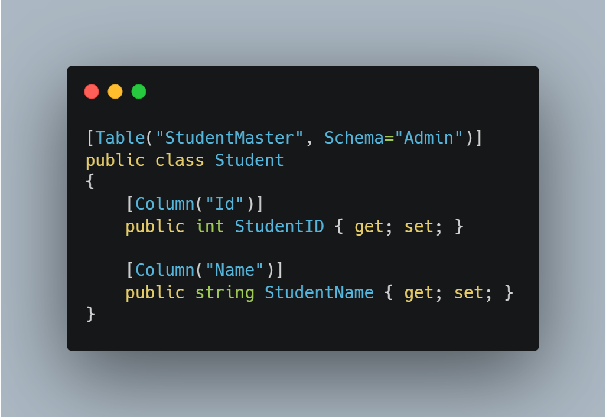
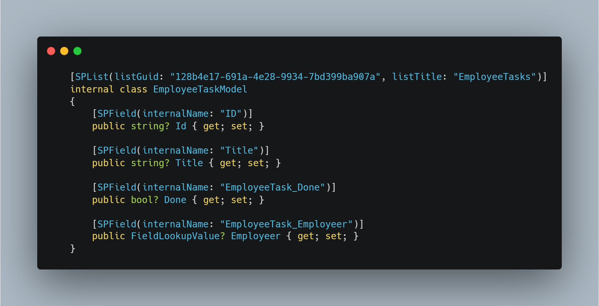

# ListItemDynamicMapper

## Summary
This is a small proof of concept (POC) for using custom attributes to map SharePoint list items to class models. It's similar to what we are used to in EF6, where we have the Column attribute and Table attribute.

### EF6


### Our POC



**Get items**
```cs
IEnumerable<EmployeeTaskModel> items = context.Web.GetItems<EmployeeTaskModel>();
```

**Update a single item**
```cs
EmployeeTaskModel updateItem = context.Web.UpdateItem(item);
```

## Current limitations
| Limitation      | Description |
| ----------- | ----------- |
| FieldLookUpValue      | We can't get this to work, mainly because we can't figure out how to expand/include lookup values.       |


## Solution
| Solution            | Author(s)                                                                                                                                   |
| ------------------- | ------------------------------------------------------------------------------------------------------------------------------------------- |
| ListItemDynamicMapper | Dan Toft (Evobis ApS) [@Tanddant](https://twitter.com/Tanddant) & Jeppe Spanggaard (Evobis ApS) [@jeppesc11](https://twitter.com/jeppesc11) |